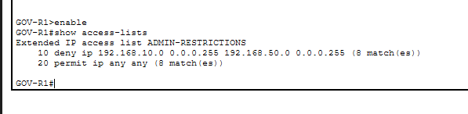

# Secure Government Office Network Lab 🔐

A hands-on network security lab designed and implemented using Cisco Packet Tracer.

The project simulates a small government office network and demonstrates practical network security controls including VLAN segmentation, access control, Layer 2 port security, secure remote management, and switch port hardening.

## 📌 Project Status

🚧 Work in Progress

The core Head Office network and its initial security controls have been implemented and tested. Further network expansion and additional security controls are planned.

## 🏢 Network Scenario

The simulated government office contains three separate network segments:

| VLAN | Department | Network |
|------|------------|---------|
| VLAN 10 | Administration | 192.168.10.0/24 |
| VLAN 20 | IT / Security | 192.168.20.0/24 |
| VLAN 50 | Internal Servers | 192.168.50.0/24 |

Each department is placed in a separate VLAN to reduce unnecessary communication between network segments and provide logical network separation.

## 🌐 Network Architecture

### Network Topology


The current network includes:

- Cisco 1941 Router (`GOV-R1`)
- Cisco 2960 Switch (`GOV-SW1`)
- Administration workstation
- IT/Security workstation
- Internal server

Inter-VLAN routing is implemented using a Router-on-a-Stick architecture with an IEEE 802.1Q trunk between `GOV-R1` and `GOV-SW1`.

## 🔒 Security Controls Implemented

### 1. VLAN Segmentation

Separate VLANs are used for Administration, IT/Security, and Internal Servers.

This limits unnecessary Layer 2 communication and creates separate security zones for different types of systems.

### 2. Extended Access Control List (ACL)

An extended ACL named `ADMIN-RESTRICTIONS` prevents the Administration VLAN from accessing the Internal Servers VLAN.

| Source | Destination | Result |
|--------|-------------|--------|
| Administration | Internal Servers | ❌ Denied |
| Administration | IT / Security | ✅ Allowed |
| IT / Security | Internal Servers | ✅ Allowed |

This policy restricts unnecessary access to sensitive internal resources while preserving required communication.

### 3. Switch Port Security

Port Security is enabled on the active access ports connected to the Administration workstation, IT/Security workstation, and Internal Server.

Sticky MAC learning is used to associate each access port with its authorized device.

Each protected port is limited to one MAC address. If an unauthorized device replaces the authorized device, the configured shutdown violation mode places the interface into a secure-shutdown state.

### 4. Unused Port Hardening

Unused switch ports are:

- Assigned to VLAN 999 (`UNUSED-PORTS`)
- Configured as access ports
- Administratively disabled

This reduces the risk of unauthorized devices being connected through unused switch interfaces.

### 5. Secure SSH Management

Remote management of `GOV-R1` is configured using SSH Version 2 instead of Telnet.

A local privileged administrative account is used for authentication. Credential information is intentionally excluded from the public repository.

### 6. Management Access Control

A standard ACL named `SSH-MANAGEMENT` restricts remote router management to the IT/Security network:

`192.168.20.0/24`

The ACL is applied to the VTY lines, and only SSH connections are permitted.

As a result:

| Source | SSH Management |
|--------|----------------|
| IT / Security VLAN | ✅ Allowed |
| Administration VLAN | ❌ Denied |

## 🧪 Security Testing

The implemented controls were validated through both positive and negative security tests.
### ACL Enforcement

The Administration workstation can communicate with permitted network resources but cannot reach the Internal Server.


The IT/Security workstation can successfully reach the Internal Server, confirming that the server remains available to an authorized network segment.


### ACL Hit Counter Verification

Router ACL counters were checked to verify that the deny rule was actively processing prohibited traffic.



### SSH Management Testing

SSH access from the IT/Security VLAN succeeds:


SSH access from the Administration VLAN is refused:


This confirms that remote management access is restricted according to the management security policy.

### Port Security Testing

An unauthorized device was connected to a protected switch port.

The switch detected a different source MAC address, recorded a security violation, and placed the interface into `secure-shutdown`.


### Unused Port Verification

The switch interface status confirms that unused interfaces are assigned to VLAN 999 and disabled, while required access ports and the router trunk remain operational.


More detailed testing evidence is available in the [`screenshots`](screenshots/) directory.

## 🛠️ Technologies and Concepts

- Cisco Packet Tracer
- Cisco IOS
- VLAN Segmentation
- IEEE 802.1Q Trunking
- Router-on-a-Stick
- Inter-VLAN Routing
- Extended ACLs
- Standard ACLs
- Port Security
- Sticky MAC Learning
- SSH Version 2
- Switch Port Hardening
- Principle of Least Privilege

## 📁 Repository Structure

```text
secure-network-design-lab/
│
├── README.md
│
├── configs/
│   ├── GOV-R1-config.txt
│   └── GOV-SW1-config.txt
│
├── packet-tracer/
│   ├── README.md
│   └── secure-government-office-network.pkt
│
└── screenshots/
    ├── README.md
    ├── network-topology.png
    ├── acl-admin-server-denied.png
    ├── acl-security-server-allowed.png
    ├── acl-hit-counters.png
    ├── ssh-security-pc-success.png
    ├── ssh-admin-pc-denied.png
    ├── port-security-violation.png
    └── unused-ports-hardening.png
```

## 🚀 Planned Improvements

The project will continue to evolve with additional network infrastructure and security controls. Planned improvements include:

- Addition of a separate DMZ for public-facing services
- Addition of a Warehouse branch network
- Site-to-Site VPN connectivity between the Head Office and Warehouse
- Additional firewall and traffic filtering policies
- Expanded security testing and documentation

## 🎯 Project Objective

The objective of this lab is to develop practical experience in designing, configuring, securing, testing, and documenting a segmented enterprise-style network.

The project focuses not only on network connectivity, but also on applying security controls and validating their effectiveness through practical testing.
