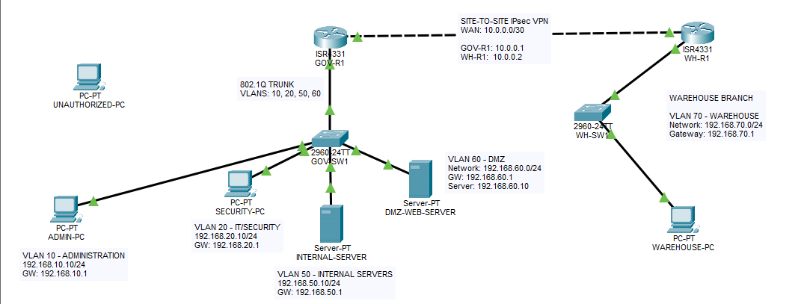

# 🔐 Secure Government Office Network Lab

> **Status: Work in Progress**

A cybersecurity networking lab designed and implemented using Cisco Packet Tracer to simulate a secure government office network.

The project demonstrates network segmentation, access control, secure device management, Layer 2 hardening, DMZ isolation, and controlled web service deployment.

---

## 🎯 Project Objectives

The main objectives of this project are to:

- Segment departments and services using VLANs
- Implement inter-VLAN routing using Router-on-a-Stick
- Restrict unauthorized communication using Access Control Lists (ACLs)
- Protect switch access ports using Port Security
- Secure unused switch ports
- Restrict router management using SSH and a management ACL
- Separate the DMZ from internal server resources
- Host a web service inside the DMZ using HTTPS
- Validate implemented security controls through functional testing

---

## 🏢 Current Network Scenario

The current implementation represents the **Head Office** of a small government organization.

| VLAN | Department / Zone | Network | Default Gateway |
|---|---|---|---|
| 10 | Administration | `192.168.10.0/24` | `192.168.10.1` |
| 20 | IT / Security | `192.168.20.0/24` | `192.168.20.1` |
| 50 | Internal Servers | `192.168.50.0/24` | `192.168.50.1` |
| 60 | DMZ | `192.168.60.0/24` | `192.168.60.1` |
| 999 | Unused Ports | N/A | N/A |

---

## 🖥️ Main Devices

| Device | Role | Address / Network |
|---|---|---|
| `GOV-R1` | Inter-VLAN Router | VLAN gateways |
| `GOV-SW1` | Head Office Access Switch | VLAN segmentation |
| `ADMIN-PC` | Administration Workstation | `192.168.10.10/24` |
| `SECURITY-PC` | IT/Security Workstation | `192.168.20.10/24` |
| `INTERNAL-SERVER` | Internal Server | `192.168.50.10/24` |
| `DMZ-WEB-SERVER` | DMZ Web Server | `192.168.60.10/24` |

---

## 🗺️ Network Topology

The Head Office currently uses four operational VLANs connected through an 802.1Q trunk between `GOV-SW1` and `GOV-R1`.



---

# 🛡️ Implemented Security Controls

## 1. VLAN Segmentation

The network is divided into separate VLANs for:

- Administration
- IT/Security
- Internal Servers
- DMZ

This reduces unnecessary Layer 2 broadcast exposure and provides logical separation between different organizational functions.

---

## 2. Router-on-a-Stick Inter-VLAN Routing

`GOV-R1` provides routing between VLANs using 802.1Q subinterfaces:

```text
G0/0.10 → VLAN 10
G0/0.20 → VLAN 20
G0/0.50 → VLAN 50
G0/0.60 → VLAN 60
```

The connection between `GOV-R1` and `GOV-SW1` operates as an 802.1Q trunk.

---

## 3. Administration Access Control

An extended ACL named:

```text
ADMIN-RESTRICTIONS
```

prevents the Administration VLAN from accessing the Internal Server VLAN.

Security policy:

```text
ADMIN → Internal Servers = DENIED
ADMIN → Other permitted networks = ALLOWED
```

The policy was validated using connectivity testing.

---

## 4. DMZ Isolation

A dedicated DMZ was implemented using VLAN 60.

The DMZ hosts:

```text
DMZ-WEB-SERVER
192.168.60.10/24
```

An extended ACL named:

```text
DMZ-RESTRICTIONS
```

prevents the DMZ from initiating communication with the Internal Server VLAN.

Current tested policy:

```text
DMZ → Internal Servers = DENIED
DMZ → IT/Security       = ALLOWED
```

This provides logical separation between the DMZ service and internal server resources.

---

## 5. HTTPS Web Service

`DMZ-WEB-SERVER` hosts a simulated Government Office Portal.

The server is configured with:

```text
HTTP  = Disabled
HTTPS = Enabled
```

HTTPS access was successfully tested from the IT/Security workstation.

> HTTPS functionality is demonstrated within the Cisco Packet Tracer simulation environment and should not be interpreted as production-grade TLS validation.

---

## 6. Port Security

Port Security with sticky MAC learning is enabled on the active access ports:

| Interface | Device | VLAN |
|---|---|---:|
| `Fa0/2` | ADMIN-PC | 10 |
| `Fa0/3` | SECURITY-PC | 20 |
| `Fa0/4` | INTERNAL-SERVER | 50 |
| `Fa0/5` | DMZ-WEB-SERVER | 60 |

Each protected access port is limited to one learned MAC address.

An unauthorized-device test was performed on `Fa0/2`, causing the port to enter a secure-shutdown state after a security violation.

---

## 7. Unused Port Hardening

Unused switch ports are:

- Assigned to VLAN 999 (`UNUSED-PORTS`)
- Configured as access ports
- Administratively shut down

The router-facing interface `Gi0/1` remains active as the 802.1Q trunk.

---

## 8. Secure SSH Management

Remote router management uses:

```text
SSH Version 2
```

Telnet is not permitted on the VTY lines.

A local privileged administrative account is used for authentication.

> Authentication secrets are intentionally excluded from the public repository.

---

## 9. SSH Management ACL

A standard ACL named:

```text
SSH-MANAGEMENT
```

restricts remote router management to:

```text
192.168.20.0/24
```

Therefore:

```text
SECURITY-PC → SSH → GOV-R1 = ALLOWED
ADMIN-PC    → SSH → GOV-R1 = DENIED
```

Both conditions were functionally tested.

---

# 🧪 Security Testing

The implemented controls were validated using several tests, including:

- Administration-to-Internal-Server access denial
- IT/Security-to-Internal-Server access success
- DMZ-to-Internal-Server access denial
- DMZ-to-IT/Security access success
- Authorized SSH management
- Unauthorized SSH management denial
- Port Security violation detection
- DMZ Port Security verification
- Unused port status verification
- HTTPS service accessibility
- HTTP service disablement

Testing screenshots are available in:

[`screenshots/`](screenshots/)

---

## 📁 Repository Structure

```text
secure-network-design-lab/
│
├── README.md
│
├── configs/
│   ├── GOV-R1-config.txt
│   └── GOV-SW1-config.txt
│
├── packet-tracer/
│   └── [Packet Tracer lab files]
│
└── screenshots/
    ├── README.md
    ├── network-topology.png
    ├── acl-admin-server-denied.png
    ├── acl-security-server-allowed.png
    ├── ssh-security-pc-success.png
    ├── ssh-admin-pc-denied.png
    ├── port-security-violation.png
    ├── unused-ports-hardening.png
    ├── dmz-internal-server-denied.png
    ├── dmz-security-pc-allowed.png
    ├── dmz-port-security.png
    ├── dmz-https-success.png
    └── dmz-http-disabled.png
```

---

## 🧰 Technologies & Concepts

- Cisco Packet Tracer
- Cisco IOS
- VLANs
- IEEE 802.1Q Trunking
- Router-on-a-Stick
- Inter-VLAN Routing
- Access Control Lists (ACLs)
- DMZ Segmentation
- Port Security
- Sticky MAC Learning
- SSH Version 2
- Layer 2 Hardening
- HTTPS Service Simulation
- Network Security Testing

---

## 🚀 Planned Improvements

The project will continue to evolve with additional infrastructure and security controls.

Planned improvements include:

- Addition of a Warehouse branch network
- Site-to-Site VPN connectivity between the Head Office and Warehouse
- Additional traffic filtering and security policies
- Expanded security testing and documentation

---

## ⚠️ Lab Scope

This project is implemented in Cisco Packet Tracer as an educational cybersecurity lab.

The DMZ currently represents a **segmented server zone within the simulated enterprise network**. External Internet/WAN connectivity, NAT, and a perimeter firewall have not yet been implemented.

The project should therefore not be interpreted as a complete production government network architecture.

---

## 👩‍💻 Author

**Abrar Al-Nairi**

Computer Engineering — Cybersecurity  
Middle East College, Oman

---

## 📌 Project Status

**Work in Progress**

Current Head Office implementation:

**VLAN Segmentation + Inter-VLAN Routing + ACLs + Port Security + Unused Port Hardening + SSH Security + DMZ Isolation + HTTPS Web Service**

Next major phase:

**Warehouse Branch Network → Site-to-Site VPN**
