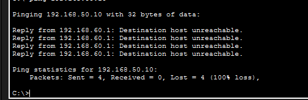
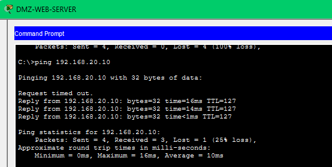
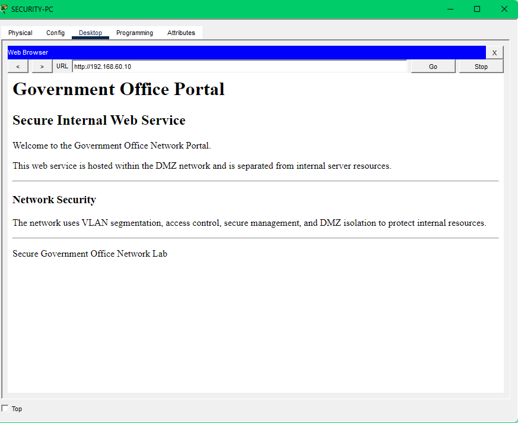
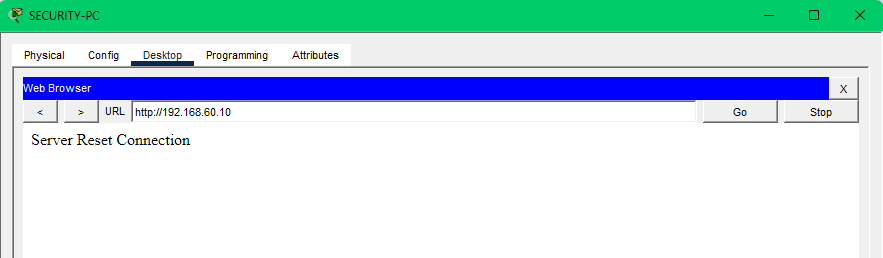
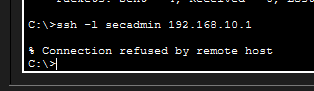
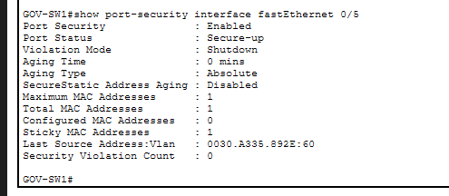

# Security Testing Evidence

This directory contains screenshots used to validate the security controls implemented in the Secure Government Office Network Lab.

---

## Network Topology

The current Head Office topology includes four segmented networks:

- VLAN 10 — Administration
- VLAN 20 — IT/Security
- VLAN 50 — Internal Servers
- VLAN 60 — DMZ

---

## ACL Enforcement — Administration Blocked

The Administration VLAN is restricted from accessing the Internal Server VLAN.

Test:

`ADMIN-PC (192.168.10.10) → INTERNAL-SERVER (192.168.50.10)`

Result: **Denied**

---

## ACL Enforcement — Security Access Allowed

The IT/Security VLAN is permitted to access the Internal Server VLAN.

Test:

`SECURITY-PC (192.168.20.10) → INTERNAL-SERVER (192.168.50.10)`

Result: **Allowed**

---

## DMZ Isolation — Internal Server Access Denied

An extended ACL named `DMZ-RESTRICTIONS` prevents devices in the DMZ from initiating access to the Internal Server VLAN.

Test:

`DMZ-WEB-SERVER (192.168.60.10) → INTERNAL-SERVER (192.168.50.10)`

Result: **Denied**

---

## DMZ Policy — IT/Security Access Allowed

Traffic from the DMZ to the IT/Security VLAN remains permitted under the current ACL policy.

Test:

`DMZ-WEB-SERVER (192.168.60.10) → SECURITY-PC (192.168.20.10)`

Result: **Allowed**

---

## HTTPS Web Service — Success

The web service hosted on `DMZ-WEB-SERVER` is accessible through HTTPS.

Test:

`SECURITY-PC → https://192.168.60.10`

Result: **HTTPS service accessible**

---

## HTTP Web Service — Disabled

Plain HTTP was disabled on the DMZ web server while HTTPS remained enabled.

Test:

`SECURITY-PC → http://192.168.60.10`

Result: **HTTP service unavailable**

> HTTPS functionality in this project is demonstrated within the Cisco Packet Tracer simulation environment.

---

## Secure SSH Management — Authorized Source

SSH version 2 is enabled on `GOV-R1`, and remote management is restricted to the IT/Security VLAN.

Test:

`SECURITY-PC (192.168.20.10) → GOV-R1`

Result: **SSH connection successful**

---

## Secure SSH Management — Unauthorized Source Denied

An SSH management ACL prevents the Administration VLAN from remotely managing the router.

Test:

`ADMIN-PC (192.168.10.10) → GOV-R1`

Result: **Connection refused**

---

## Port Security Violation

Switch access ports use Port Security with sticky MAC learning.

An unauthorized device was connected to the Administration access port `Fa0/2`.

Result:

- Unauthorized MAC address detected
- Security violation recorded
- Port entered `secure-shutdown`

---

## DMZ Port Security

Port Security is also enabled on `Fa0/5`, which connects the DMZ web server.

The switch learned the server MAC address using sticky MAC:

`0030.A335.892E`

Result:

- Port Security: **Enabled**
- Port Status: **Secure-up**
- Maximum MAC addresses: **1**
- Sticky MAC addresses: **1**

---

## Unused Port Hardening

Unused switch ports are assigned to VLAN 999 (`UNUSED-PORTS`) and administratively shut down.

The current interface status also shows:

- `Fa0/2` → VLAN 10
- `Fa0/3` → VLAN 20
- `Fa0/4` → VLAN 50
- `Fa0/5` → VLAN 60
- `Gi0/1` → 802.1Q trunk
- Unused ports → VLAN 999 / disabled

---

## Summary

The screenshots demonstrate successful validation of:

- VLAN segmentation
- Inter-VLAN access control
- Administration-to-server restrictions
- DMZ isolation
- HTTPS-only web service configuration
- SSH management restrictions
- Port Security with sticky MAC learning
- Unauthorized device detection
- Unused port hardening

These tests provide evidence that the configured security controls operate as intended within the Packet Tracer lab environment.
