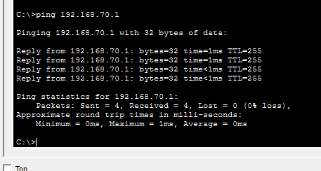
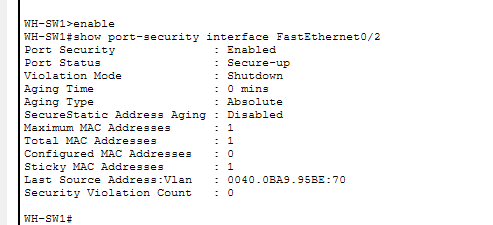
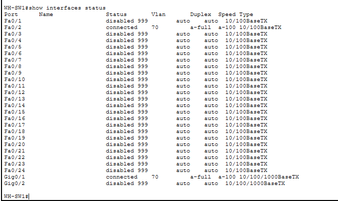
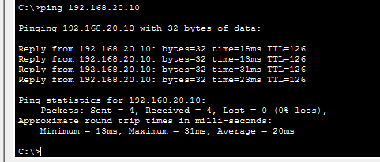
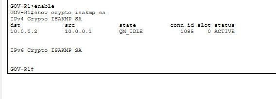
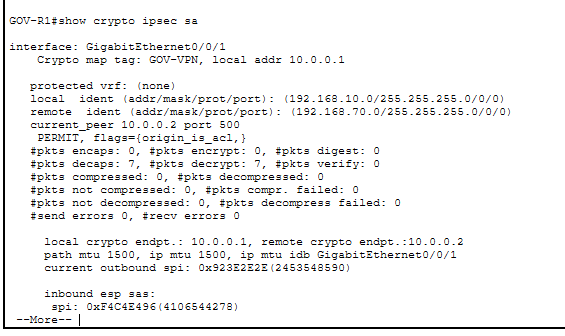

# Security Testing Evidence

This directory contains screenshots used to validate the network connectivity and security controls implemented in the Secure Government Office Network Lab.

---

## Network Topology

The current lab consists of a segmented Head Office and a Warehouse Branch connected through a simulated point-to-point WAN and protected by a Site-to-Site IPsec VPN.

### Head Office

- VLAN 10 — Administration
- VLAN 20 — IT/Security
- VLAN 50 — Internal Servers
- VLAN 60 — DMZ

### Warehouse Branch

- VLAN 70 — Warehouse
- Network: `192.168.70.0/24`
- Default Gateway: `192.168.70.1`

### Inter-Site WAN

- WAN Network: `10.0.0.0/30`
- GOV-R1: `10.0.0.1`
- WH-R1: `10.0.0.2`
- Site-to-Site IPsec VPN enabled between both ISR4331 routers

---

# Head Office Security Validation

## ACL Enforcement — Administration Blocked

The Administration VLAN is restricted from accessing the Internal Server VLAN.

Test:

`ADMIN-PC (192.168.10.10) → INTERNAL-SERVER (192.168.50.10)`

Result: **Denied**

---

## ACL Enforcement — Security Access Allowed

The IT/Security VLAN is permitted to access the Internal Server VLAN.

Test:

`SECURITY-PC (192.168.20.10) → INTERNAL-SERVER (192.168.50.10)`

Result: **Allowed**

---

## DMZ Isolation — Internal Server Access Denied

An extended ACL named `DMZ-RESTRICTIONS` prevents devices in the DMZ from initiating access to the Internal Server VLAN.

Test:

`DMZ-WEB-SERVER (192.168.60.10) → INTERNAL-SERVER (192.168.50.10)`

Result: **Denied**

---

## DMZ Policy — IT/Security Access Allowed

Traffic from the DMZ to the IT/Security VLAN remains permitted under the current ACL policy.

Test:

`DMZ-WEB-SERVER (192.168.60.10) → SECURITY-PC (192.168.20.10)`

Result: **Allowed**

---

## HTTPS Web Service — Success

The web service hosted on `DMZ-WEB-SERVER` is accessible through HTTPS.

Test:

`SECURITY-PC → https://192.168.60.10`

Result: **HTTPS service accessible**

---

## HTTP Web Service — Disabled

Plain HTTP was disabled on the DMZ web server while HTTPS remained enabled.

Test:

`SECURITY-PC → http://192.168.60.10`

Result: **HTTP service unavailable**

> HTTPS functionality in this project is demonstrated within the Cisco Packet Tracer simulation environment.

---

## Secure SSH Management — Authorized Source

SSH version 2 is enabled on `GOV-R1`, and remote management is restricted to the IT/Security VLAN.

Test:

`SECURITY-PC (192.168.20.10) → GOV-R1`

Result: **SSH connection successful**

---

## Secure SSH Management — Unauthorized Source Denied

An SSH management ACL prevents the Administration VLAN from remotely managing the router.

Test:

`ADMIN-PC (192.168.10.10) → GOV-R1`

Result: **Connection refused**

---

## Port Security Violation

Switch access ports use Port Security with sticky MAC learning.

An unauthorized device was connected to the Administration access port `Fa0/2`.

Result:

- Unauthorized MAC address detected
- Security violation recorded
- Port entered `secure-shutdown`

---

## DMZ Port Security

Port Security is also enabled on `Fa0/5`, which connects the DMZ web server.

The switch learned the server MAC address using sticky MAC:

`0030.A335.892E`

Result:

- Port Security: **Enabled**
- Port Status: **Secure-up**
- Maximum MAC addresses: **1**
- Sticky MAC addresses: **1**

---

## Head Office Unused Port Hardening

Unused switch ports on `GOV-SW1` are assigned to VLAN 999 (`UNUSED-PORTS`) and administratively shut down.

The interface status shows:

- `Fa0/2` → VLAN 10
- `Fa0/3` → VLAN 20
- `Fa0/4` → VLAN 50
- `Fa0/5` → VLAN 60
- `Gi0/1` → 802.1Q trunk
- Unused ports → VLAN 999 / disabled

---

# Warehouse Branch Validation

## Warehouse Gateway Connectivity

Local connectivity was verified between the Warehouse workstation and its default gateway.

Test:

`WAREHOUSE-PC (192.168.70.10) → WH-R1 (192.168.70.1)`

Result: **Successful — 0% packet loss**

---

## Warehouse Port Security

Port Security with sticky MAC learning is enabled on `WH-SW1` access port `Fa0/2`, which connects `WAREHOUSE-PC`.

Validation confirms:

- Port Security: **Enabled**
- Port Status: **Secure-up**
- Violation Mode: **Shutdown**
- Maximum MAC addresses: **1**
- Sticky MAC learning: **Enabled**

---

## Warehouse Unused Port Hardening

Unused interfaces on `WH-SW1` are assigned to VLAN 999 (`UNUSED-PORTS`) and administratively shut down.

This reduces exposure from unused physical switch ports.

---

# Site-to-Site IPsec VPN Validation

## Inter-Site Connectivity

Connectivity was successfully verified between the Warehouse Branch and the IT/Security network at the Head Office.

Test:

`WAREHOUSE-PC (192.168.70.10) → SECURITY-PC (192.168.20.10)`

Result: **Successful**

---

## IKE Security Association — Active

The IKE Security Association between `GOV-R1` and `WH-R1` was verified using:

`show crypto isakmp sa`

The VPN negotiation reached:

- State: `QM_IDLE`
- Status: `ACTIVE`

This confirms that the IKE negotiation successfully established an active Security Association between the VPN peers.

---

## IPsec Encryption Verification

IPsec packet processing was verified using:

`show crypto ipsec sa`

For traffic between the Warehouse network and the Head Office IT/Security network, the output showed active IPsec Security Associations and non-zero packet encryption counters.

The active transform set uses:

- `esp-aes`
- `esp-sha-hmac`
- IPsec Tunnel Mode

The packet counters provide evidence that inter-site traffic is being processed and encrypted by the IPsec tunnel.

---

## Summary

The screenshots provide evidence for the successful validation of:

- VLAN segmentation at the Head Office
- Inter-VLAN routing and access control
- Administration-to-server restrictions
- DMZ isolation
- HTTPS-only DMZ web service configuration
- Restricted SSH router management
- Port Security with sticky MAC learning
- Unauthorized device detection
- Unused switch port hardening
- Warehouse VLAN 70 connectivity
- Warehouse Port Security
- Warehouse unused-port hardening
- Head Office-to-Warehouse routing
- Site-to-Site IPsec VPN establishment
- Active IKE Security Association
- IPsec packet encryption across the inter-site link

These tests demonstrate that the implemented connectivity and security controls operate as intended within the Cisco Packet Tracer simulation environment.

> This project is a lab simulation. The cryptographic options available in Cisco Packet Tracer are used for demonstration purposes and should not be interpreted as current production cryptographic recommendations.These tests provide evidence that the configured security controls operate as intended within the Packet Tracer lab environment.
