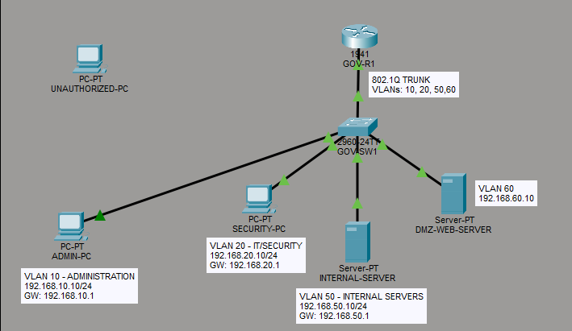
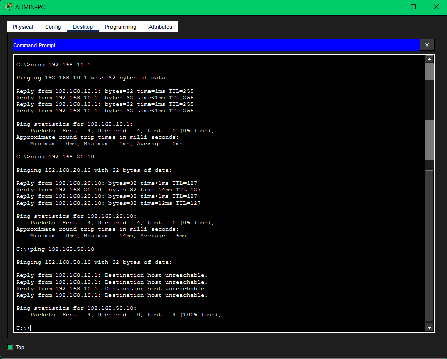
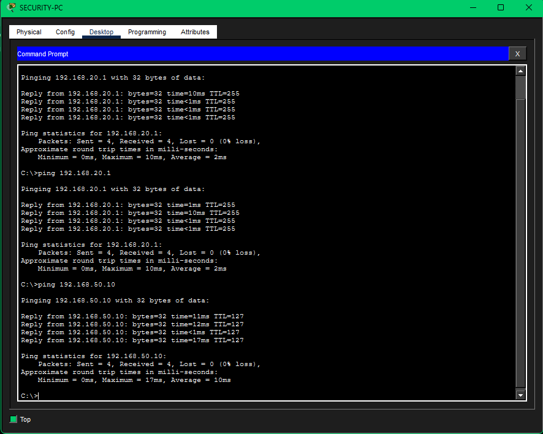
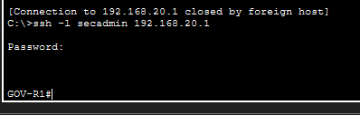
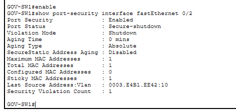
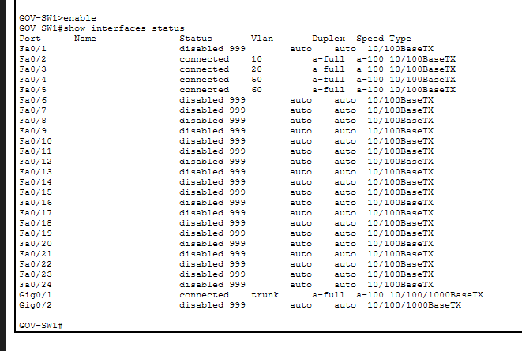

# Security Testing Evidence

This directory contains screenshots demonstrating the security controls implemented and tested in the Secure Government Office Network Lab.

## Network Topology

The topology consists of a Cisco router and switch with three segmented VLANs:

- VLAN 10 — Administration
- VLAN 20 — IT/Security
- VLAN 50 — Internal Servers

Inter-VLAN routing is provided through an 802.1Q trunk using a router-on-a-stick design.

---

## ACL Enforcement — Administration Blocked

The Administration PC can reach its default gateway and the IT/Security network, but access to the Internal Server (`192.168.50.10`) is denied.

This validates the `ADMIN-RESTRICTIONS` extended ACL applied to VLAN 10.

---

## ACL Enforcement — Security Access Allowed

The IT/Security PC successfully reaches the Internal Server (`192.168.50.10`).

This confirms that server connectivity remains available to authorized security personnel while Administration access is restricted.

---

## Secure SSH Management — Authorized

Remote SSH management of `GOV-R1` succeeds from the IT/Security VLAN using SSH Version 2.

---

## Secure SSH Management — Unauthorized Source Denied

An SSH connection initiated from the Administration VLAN is refused.

Remote router management is restricted to the IT/Security network using the `SSH-MANAGEMENT` access control list applied to the VTY lines.

---

## Port Security Violation

Port Security detects an unauthorized MAC address connected to `Fa0/2`.

The switch places the interface into `secure-shutdown` state and records a security violation, demonstrating protection against unauthorized device replacement.

---

## Unused Port Hardening

Unused switch interfaces are assigned to VLAN 999 (`UNUSED-PORTS`) and administratively disabled.

Only required access ports and the router trunk remain operational.

---

## Security Controls Demonstrated

The testing evidence demonstrates:

- VLAN-based network segmentation
- Inter-VLAN routing
- Extended ACL enforcement
- Restricted access to internal server resources
- SSH Version 2 remote management
- Management access restricted to the IT/Security VLAN
- Port Security with sticky MAC learning
- Automatic shutdown following a Port Security violation
- Unused switch port isolation and shutdown
